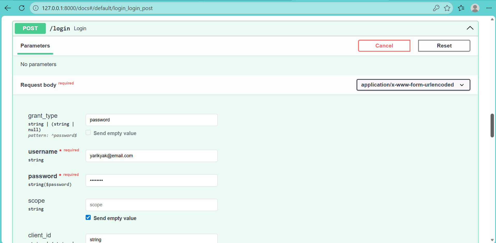

# Мой ЛЛМ проект

Проект представляет собой построение защищённого API для работы с большой языковой моделью через OpenRouter. Реализована аутентификация пользователей (JWT), хранение истории диалогов в SQLite, интеграция с OpenRouter API. Стек: FastAPI, SQLAlchemy (асинхронный), Pydantic, uv.

## Требования

- Python 3.11+
- uv (установлен глобально)
- SQLite (идёт в комплекте с Python)

## Реализованные возможности:

- Регистрация и аутентификация пользователей (JWT access token).
- Чат с LLM через OpenRouter.
- Сохранение истории сообщений в БД.
- Просмотр и очистка истории сообщений.

## Установка

1. Клонируйте репозиторий:  

```bash
   git clone https://ваш-репозиторий.git
   cd ваш-проект

```
2. Установите зависимости:  

```bash
   uv pip install .

```
3. Настройте `.env` (скопируйте шаблон):  

```bash
   cp .env.example .env
   # отредактируйте значения при необходимости
```
## Скрины работы эндпоинтов:

1. Регистрация пользователя

2. Ввод логин для получения JWT

3. Получение JWT

4. Авторизация пользователя

5. Промт

6. Получение истории

7. Удаление истории
